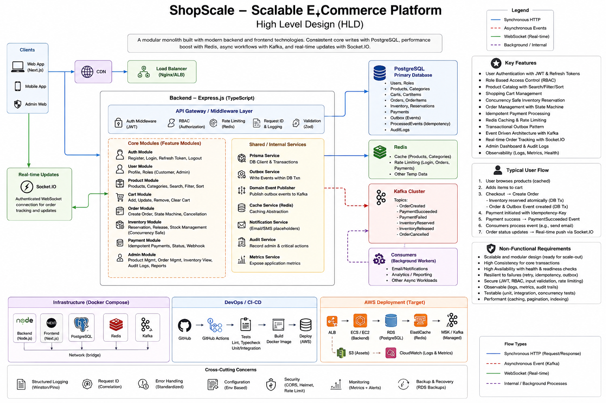
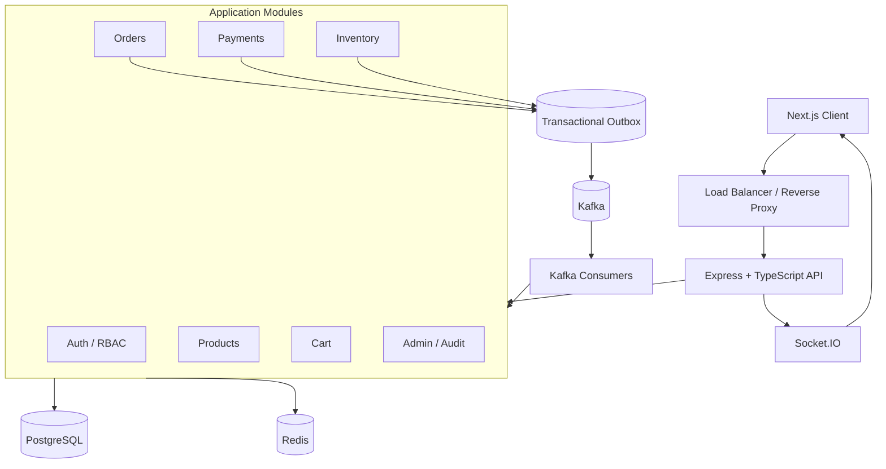
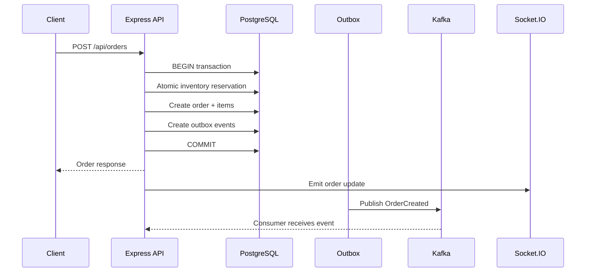
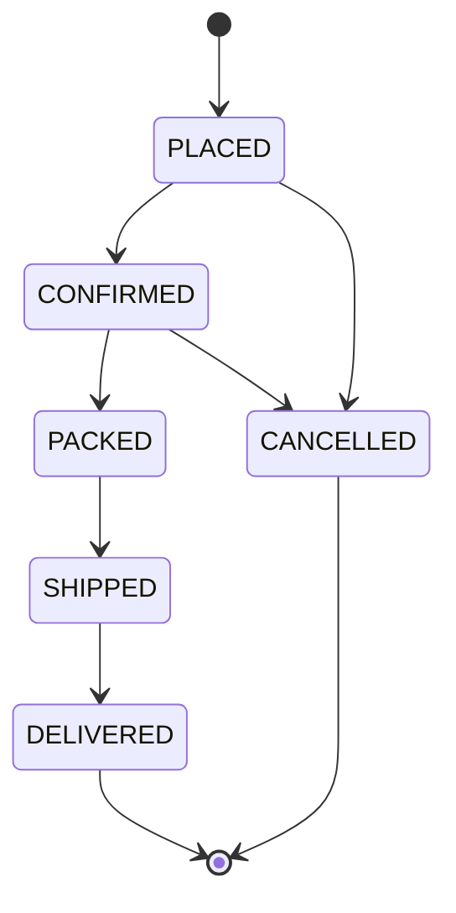
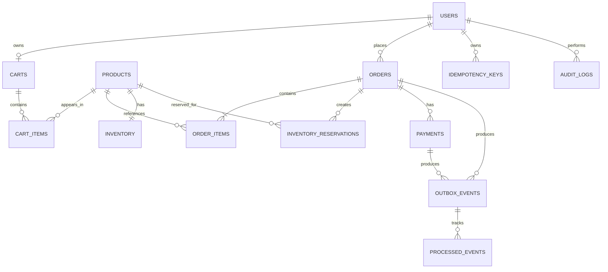
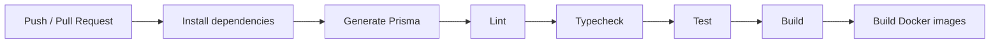

# ShopScale

> **A production-minded e-commerce and order-management platform built as a TypeScript modular monolith.**

ShopScale is designed to demonstrate the engineering problems that appear in real backend systems: authentication and authorization, transactional data consistency, concurrent inventory updates, retry-safe payments, caching, rate limiting, asynchronous event processing, real-time updates, testing, observability, CI/CD, and cloud deployment.

The project deliberately starts as a **modular monolith** rather than a collection of microservices. This keeps core business logic easy to reason about while leaving clear module boundaries for future extraction when independent scaling or deployment becomes justified.

---

## Table of Contents

- [Why ShopScale](#why-shopscale)
- [Architecture](#architecture)
- [Technology Stack](#technology-stack)
- [Core Features](#core-features)
- [System Flows](#system-flows)
- [Concurrency-Safe Inventory](#concurrency-safe-inventory)
- [Payment Idempotency](#payment-idempotency)
- [Redis Caching and Rate Limiting](#redis-caching-and-rate-limiting)
- [Kafka and Transactional Outbox](#kafka-and-transactional-outbox)
- [Real-Time Order Tracking](#real-time-order-tracking)
- [Authentication and Authorization](#authentication-and-authorization)
- [Order State Machine](#order-state-machine)
- [Database Design](#database-design)
- [API Overview](#api-overview)
- [Frontend](#frontend)
- [Admin and Observability](#admin-and-observability)
- [Testing](#testing)
- [Load Testing](#load-testing)
- [Docker and Local Development](#docker-and-local-development)
- [CI/CD](#cicd)
- [AWS Deployment](#aws-deployment)
- [Repository Structure](#repository-structure)
- [Design Decisions](#design-decisions)
- [Verification Status](#verification-status)
- [Future Improvements](#future-improvements)
- [Learning / Interview Topics](#learning--interview-topics)

---

## Why ShopScale?

ShopScale is intentionally more than a CRUD shopping application.

The project focuses on five real engineering problems:

```text
1. Data correctness
   PostgreSQL transactions + constraints

2. Concurrent writes
   Atomic inventory reservation

3. Safe retries
   Payment idempotency

4. Scale and asynchronous work
   Redis + Kafka + transactional outbox

5. Real-time user experience
   Socket.IO
```

The result is a compact application that can be discussed from both a **software engineering** and **system design** perspective.

---

# Architecture

## High-Level Architecture



The application follows a modular-monolith architecture with PostgreSQL as the source of truth, Redis for low-latency shared state, Kafka for asynchronous event delivery, and Socket.IO for real-time client updates.



## Architectural Style

### Why a modular monolith?

Microservices would add service discovery, network failure, distributed transactions, deployment complexity, and operational overhead without being necessary for the current project scope.

Instead, ShopScale keeps strong module boundaries inside one deployable application:

```text
apps/backend/src/
├── modules/
│   ├── auth/
│   ├── users/
│   ├── products/
│   ├── cart/
│   ├── orders/
│   ├── inventory/
│   ├── payments/
│   ├── admin/
│   └── ...
├── infrastructure/
│   ├── database/
│   ├── redis/
│   ├── kafka/
│   ├── websocket/
│   └── logging/
└── common/
```

This gives the project a clean path from:

```text
Modular Monolith
      ↓
Independent scaling requirements appear
      ↓
Extract only the necessary module/service
```

---

# Technology Stack

| Layer | Technology | Purpose |
|---|---|---|
| Backend | Node.js + Express 5 | HTTP API and application runtime |
| Language | TypeScript | Type safety and maintainability |
| Frontend | Next.js + React | Web application |
| Styling | Tailwind CSS | UI styling |
| Database | PostgreSQL | Source of truth and transactional consistency |
| ORM | Prisma | Type-safe database access and migrations |
| Cache | Redis | Caching and distributed rate limiting |
| Messaging | KafkaJS + Kafka | Asynchronous domain events |
| Reliability | Transactional Outbox | Reliable DB-to-event handoff |
| Realtime | Socket.IO | Live order status updates |
| Authentication | JWT + refresh tokens | Identity and session lifecycle |
| Password security | scrypt | Password hashing |
| Testing | Jest + Supertest | Unit and HTTP/integration testing |
| Containers | Docker Compose | Reproducible local environment |
| CI/CD | GitHub Actions | Automated validation and builds |
| Load testing | k6 | Performance testing |
| Cloud | AWS | Production deployment target |

---

# Core Features

## Commerce

- Customer registration, login, refresh, logout, and profile access
- Customer/Admin role-based access control
- Product and category management
- Pagination, filtering, sorting, search, and validation
- Redis cache-aside product reads
- Authenticated shopping cart
- Transactional order creation
- Atomic inventory reservation
- Inventory release during cancellation
- Order history and order details
- Order state transitions
- Simulated payment provider
- Retry-safe payment idempotency

## Events and Realtime

- Transactional outbox events
- Kafka producer and consumer
- Duplicate-safe event processing
- Broker retry behavior
- Authenticated Socket.IO connections
- Owner-only order subscriptions
- Real-time order updates

## Admin and Operations

- Admin order listing and status changes
- Inventory visibility
- Audit logs for sensitive admin actions
- Structured request logging
- Correlation/request IDs
- `/health`
- `/ready`
- `/metrics`
- Redis-backed rate limiting

---

# System Flows

## Order Creation Flow



## Cancellation Flow

```text
Customer
   |
   v
POST /orders/:id/cancel
   |
   v
Validate ownership + state
   |
   v
PostgreSQL transaction
   |
   +--> mark order CANCELLED
   +--> release inventory reservation
   +--> write OrderCancelled event
   |
   v
COMMIT
   |
   +--> Socket.IO update
   +--> Kafka event
```

---

# Concurrency-Safe Inventory

Inventory is one of the most important engineering parts of ShopScale.

Suppose only one item remains:

```text
availableQuantity = 1
```

and 100 users try to purchase it simultaneously.

## Unsafe approach

A naive implementation would do:

```text
Read stock
    ↓
if stock >= quantity
    ↓
Update stock
```

Two requests can read the same value before either update completes:

```text
Request A → reads 1
Request B → reads 1
Request A → decrements
Request B → decrements
```

This is a classic race condition.

## ShopScale approach

The reservation is performed using an atomic conditional update inside a PostgreSQL transaction:

```sql
UPDATE inventory
SET
    available_quantity = available_quantity - :quantity,
    reserved_quantity  = reserved_quantity + :quantity,
    version            = version + 1
WHERE product_id = :product_id
  AND available_quantity >= :quantity;
```

The application then checks the affected row count:

```text
1 row updated
    → reservation succeeded

0 rows updated
    → insufficient stock / reservation failed
```

The important property is:

> The stock check and stock decrement happen atomically at the database level.

This prevents inventory from becoming negative and makes the operation safe under concurrent requests.

## Transactional consistency

Order creation groups the consistency-critical writes into a transaction:

```text
BEGIN
  ↓
reserve inventory
  ↓
create order
  ↓
create order items
  ↓
create reservation records
  ↓
write outbox event(s)
  ↓
COMMIT
```

If a required operation fails:

```text
ROLLBACK
```

No partial order should be committed.

---

# Payment Idempotency

Payment APIs are retry-sensitive.

A client can send a payment request, the server can successfully process it, and the response can be lost due to a network failure. The client may then retry.

Without idempotency:

```text
Request 1 → payment created
Request 2 → payment created again ❌
```

## Idempotency-Key

ShopScale accepts:

```http
Idempotency-Key: abc123
```

The server records the key and the completed response.

```text
Request
  ↓
Idempotency-Key
  ↓
Already processed?
  ├── YES → replay previous response
  └── NO  → process payment
```

A reused key with a different request body is rejected instead of silently changing the meaning of the original operation.

## Concurrent duplicates

The important case is two identical requests arriving at nearly the same time.

The database uniqueness constraint provides a safe coordination point:

```text
Request A ─┐
           ├── same idempotency key
Request B ─┘

One request wins
      ↓
Other request resolves to existing result
```

The application therefore does not depend on an in-memory map that would fail across multiple backend instances.

---

# Redis Caching and Rate Limiting

## Product Cache

ShopScale uses a cache-aside strategy for product reads.

```text
GET /products/:id
        |
        v
      Redis
      /   \
    HIT   MISS
    |       |
 return   PostgreSQL
            |
            v
          Redis
            |
            v
          return
```

Features:

- configurable TTL
- cache population on misses
- invalidation after product updates/deletes

The database remains the source of truth.

## Why Redis?

Redis provides low-latency shared state across multiple application instances.

This is useful for both:

```text
Cache
Rate limiting
```

rather than storing state only inside one Node.js process.

## Distributed Rate Limiting

Rate limiting is applied to sensitive endpoints such as:

- login
- order creation
- payment creation

Conceptually:

```text
Client / account
      ↓
Redis counter/window
      ↓
within limit? ── YES → request continues
      |
      NO
      ↓
HTTP 429 Too Many Requests
```

The current implementation uses a fixed-window approach.

---

# Kafka and Transactional Outbox

## Why Kafka?

Kafka is used for asynchronous domain events rather than as a cache or primary database.

Examples of events:

```text
OrderCreated
PaymentSucceeded
PaymentFailed
InventoryReserved
InventoryReleased
OrderCancelled
```

This allows event consumers to react independently from the synchronous HTTP request.

## The dual-write problem

A dangerous implementation would do:

```text
1. Commit PostgreSQL transaction
2. Publish Kafka event
```

What if step 1 succeeds but step 2 fails?

```text
Database → SUCCESS ✅
Kafka    → FAILURE ❌
```

The order exists but the event was lost.

## Transactional Outbox

ShopScale solves this by writing the business data and the outbox event in the **same PostgreSQL transaction**:

```text
BEGIN

Create order
Reserve inventory
Write outbox event

COMMIT
```

Then a background publisher reads unpublished outbox records:

```text
PostgreSQL Outbox
      ↓
   Publisher
      ↓
    Kafka
      ↓
  Consumers
```

This provides a durable handoff from the database transaction to the event system.

## Duplicate-Safe Consumers

Consumers must not assume a message is processed exactly once.

ShopScale records processed event identifiers so a duplicate delivery can be ignored safely:

```text
Kafka message
      ↓
Already processed?
   /        \
 YES        NO
  |          |
 ignore    process
             |
             v
      mark processed
```

The system therefore treats **at-least-once delivery + idempotent consumers** as the safer business-level model.

---

# Real-Time Order Tracking

Socket.IO is used for client-facing real-time updates.

Example lifecycle:

```text
PLACED
  ↓
CONFIRMED
  ↓
PACKED
  ↓
SHIPPED
  ↓
DELIVERED
```

When the order changes, the backend emits a real-time update to the authorized client.

## Authorization

A user cannot subscribe to another user's private order updates.

Conceptually:

```text
Socket connection
      ↓
Authenticate user
      ↓
Order subscription requested
      ↓
Verify order belongs to user
      ↓
Allow / deny subscription
```

This mirrors the same authorization model used by REST APIs.

---

# Authentication and Authorization

## Authentication

Registration:

```text
Email + password
      ↓
Password hashing (scrypt)
      ↓
Persist user
```

Login:

```text
Email + password
      ↓
Verify password
      ↓
Issue access token
      ↓
Issue/rotate refresh token
```

Every protected request derives the authenticated identity from the verified token rather than trusting a client-supplied user ID.

## Authorization

ShopScale has two primary roles:

```text
CUSTOMER
ADMIN
```

Authentication answers:

> Who are you?

Authorization answers:

> What are you allowed to do?

Example:

```text
GET  /api/products
→ CUSTOMER ✅

POST /api/products
→ CUSTOMER ❌
→ ADMIN ✅
```

---

# Order State Machine

Order state transitions are explicit rather than allowing arbitrary status updates.



This prevents invalid transitions such as:

```text
DELIVERED → PLACED
CANCELLED → SHIPPED
```

The state machine is also independently tested.

---

# Database Design

Core entities include:

```text
users
roles
categories
products
inventory
carts
cart_items
orders
order_items
inventory_reservations
payments
idempotency_keys
notifications
outbox_events
processed_events
audit_logs
```

## Simplified relationship model



## Database principles

- PostgreSQL is the source of truth.
- Foreign keys enforce relationships.
- Unique constraints protect identities and idempotency keys.
- Indexes support common lookup paths.
- Transactions protect multi-row business operations.
- Monetary values are persisted using safe database types rather than floating-point arithmetic.

---

# API Overview

## Authentication

```http
POST /api/auth/register
POST /api/auth/login
POST /api/auth/refresh
POST /api/auth/logout
GET  /api/users/me
```

## Products and categories

```http
GET    /api/products
GET    /api/products/:id
POST   /api/products
PATCH  /api/products/:id
DELETE /api/products/:id

GET    /api/categories
POST   /api/categories
PATCH  /api/categories/:id
DELETE /api/categories/:id
```

Product listing supports pagination, filtering, search, sorting, and validation.

## Cart

```http
GET    /api/cart
POST   /api/cart/items
PATCH  /api/cart/items/:id
DELETE /api/cart/items/:id
DELETE /api/cart
```

## Orders

```http
POST /api/orders
GET  /api/orders
GET  /api/orders/:id
POST /api/orders/:id/cancel
```

## Payments

```http
POST /api/payments
GET  /api/payments/:id
```

Payment creation supports `Idempotency-Key`.

## Admin

```http
GET   /api/admin/orders
PATCH /api/admin/orders/:id/status
GET   /api/admin/inventory
GET   /api/admin/audit-logs
```

## Operations

```http
GET /health
GET /ready
GET /metrics
```

---

# Frontend

The Next.js frontend is intentionally functional rather than design-heavy.

It includes:

- registration/login
- product listing
- product detail
- cart
- checkout
- order history
- live order tracking
- basic admin views

The frontend communicates with the backend over REST and Socket.IO.

The UI is not the main focus of the project; the backend consistency and systems behavior are.

---

# Admin and Observability

## Admin capabilities

Administrators can:

- manage products
- inspect orders
- update order status
- inspect inventory
- review audit records

Sensitive administrative actions create audit records so the system can answer:

```text
Who?
What changed?
When?
```

## Observability

The backend includes:

- structured request logging
- request/correlation IDs
- request metrics
- rate-limit counters
- health endpoint
- readiness endpoint
- lightweight metrics endpoint

### Health vs readiness

`/health` answers whether the application process is alive.

`/ready` answers whether the application is ready to serve traffic and its critical dependencies are available.

---

# Testing

Testing focuses on behavior rather than artificial coverage targets.

## Unit tests

Business rules such as:

- authentication behavior
- validation
- order state transitions
- inventory logic
- idempotency behavior

## Integration / HTTP tests

Important flows include:

- authentication
- authorization
- products
- cart
- order creation
- inventory
- payment
- admin behavior

## Concurrency tests

A dedicated inventory scenario verifies that simultaneous attempts against limited inventory do not oversell.

Conceptually:

```text
Stock = 1
Buyers = 100

Expected:
Successful reservations <= 1
Inventory >= 0
```

## Event tests

The event suite covers:

- event serialization
- publisher behavior
- duplicate-safe consumption

---

# Load Testing

The repository includes a k6 scenario for:

- product reads
- registration/authentication
- authenticated order requests

Run it with:

```bash
k6 run \
  -e BASE_URL=http://localhost:4000 \
  -e TEST_EMAIL=buyer@example.com \
  load-tests/shopscale.js
```

k6 reports actual runtime measurements such as:

- throughput
- request duration
- p50
- p95
- p99
- checks
- error rate

The repository intentionally does **not** contain fabricated benchmark numbers.

---

# Docker and Local Development

## Requirements

- Node.js 20.11+
- npm
- Docker Desktop
- k6 for load testing

The project has been validated with Node.js 24.13.

## Setup

```bash
npm install
cp .env.example .env
```

Start the complete local stack:

```bash
docker compose up --build
```

Apply Prisma migrations when required:

```bash
npm run db:migrate -w apps/backend
```

## Local endpoints

```text
Frontend       http://localhost:3000
Backend        http://localhost:4000
Health         http://localhost:4000/health
Readiness      http://localhost:4000/ready
Metrics        http://localhost:4000/metrics
```

The Compose backend uses the internal Kafka address:

```text
kafka:29092
```

Host-based development uses:

```text
localhost:9092
```

---

# Verification

Run the same core checks used by CI:

```bash
npm run db:generate -w apps/backend
npx prisma validate --schema apps/backend/prisma/schema.prisma
npm run lint
npm run typecheck
npm test
npm run build
```

The current implementation has been verified under Node 24 with:

```text
Prisma generation      ✅
Prisma validation      ✅
Lint                   ✅
Typecheck              ✅
Automated tests        ✅ 37/37
Backend build          ✅
Frontend build         ✅
```

### Verification limitation

A live Kafka broker / Docker Compose integration run still needs to be performed in an environment where Docker is available. Browser-level frontend E2E testing should also be performed before describing the platform as fully production-verified.

This distinction is intentional: the repository documents what has actually been tested rather than overstating production readiness.

---

# CI/CD

The GitHub Actions workflow is designed to validate changes automatically.



The workflow keeps code-quality gates close to the repository rather than relying only on manual testing.

Production credentials are not stored in source control.

---

# AWS Deployment

The recommended production shape is intentionally simple:

```text
                    Internet
                       |
                       v
              Application Load Balancer
                       |
                       v
              Backend container(s)
                 /     |      \
                /      |       \
               v       v        v
             RDS     Redis     Kafka
          PostgreSQL  Cache   / Stream
```

Possible AWS components:

- ECS Fargate or App Runner for containers
- RDS PostgreSQL
- ElastiCache Redis
- Amazon MSK or another managed Kafka-compatible service
- Application Load Balancer
- CloudWatch logs/metrics
- Secrets Manager or SSM Parameter Store

The deployment guidance is designed so that production credentials are supplied by the deployment environment or OIDC-based CI rather than committed to Git.

---

# Repository Structure

```text
ShopScale/
├── apps/
│   ├── backend/
│   │   ├── prisma/
│   │   ├── src/
│   │   │   ├── common/
│   │   │   ├── infrastructure/
│   │   │   └── modules/
│   │   └── test/
│   │
│   └── frontend/
│       └── src/
│
├── docs/
│   ├── architecture.md
│   ├── api.md
│   ├── database.md
│   ├── concurrency.md
│   ├── caching.md
│   ├── messaging.md
│   ├── deployment.md
│   ├── testing.md
│   └── decisions.md
│
├── infrastructure/
│   └── aws/
│
├── load-tests/
│   └── shopscale.js
│
├── .github/
│   └── workflows/
│
├── assets/
│   └── shopscale-hld.png
│
├── docker-compose.yml
├── package.json
└── README.md
```

---

# Design Decisions

## PostgreSQL over NoSQL

Orders, payments, inventory, users, and reservations have strong relational and transactional requirements.

## Redis for shared low-latency state

Redis is a good fit for cache-aside reads and distributed rate limiting without becoming the source of truth.

## Kafka for asynchronous domain events

Kafka separates event-driven processing from synchronous request handling.

## Transactional Outbox

The outbox avoids losing events when a database transaction commits but a Kafka publish fails afterward.

## Atomic inventory reservation

The database performs the stock check and decrement atomically rather than relying on a vulnerable read-then-write sequence.

## Idempotency Keys

Retry-sensitive operations such as payment creation must be safe to repeat.

## Modular monolith instead of microservices

The project's scope does not justify the operational complexity of independently deployed services, but the code maintains module boundaries so extraction is possible later.

## Socket.IO for realtime UX

Order state changes are pushed to connected clients rather than repeatedly polling the backend.

---

# Future Improvements

Possible next-stage production improvements include:

- live Kafka integration tests using ephemeral containers
- browser E2E tests
- refresh-token rotation hardening with a dedicated session store
- dead-letter handling and stronger Kafka retry policies
- schema-versioned events
- stronger metrics and tracing
- Redis-backed Socket.IO adapter for horizontally scaled realtime delivery
- database read replicas for read-heavy traffic
- object storage/CDN for product media
- infrastructure as code with Terraform
- staged production deployment with automated rollback

These are deliberately listed as future improvements rather than pretending they already exist.

---

# Interview / Learning Topics

ShopScale is designed to support SDE-1 interview discussion around:

### Backend

- REST API design
- middleware
- dependency injection
- modular architecture
- validation
- error handling

### Databases

- transactions
- isolation levels
- atomic updates
- row locking
- indexes
- query optimization
- relational modeling

### Distributed systems

- caching
- rate limiting
- idempotency
- event-driven architecture
- Kafka producers/consumers
- at-least-once delivery
- transactional outbox

### System design

- horizontal scaling
- load balancing
- stateful vs stateless services
- database bottlenecks
- cache invalidation
- asynchronous processing
- failure handling

### Testing

- unit testing
- integration testing
- concurrency testing
- API testing
- load testing

### DevOps

- Docker
- CI/CD
- health checks
- AWS deployment
- observability

---

# Key Takeaway

ShopScale is not built around the number of technologies used. It is built around **engineering problems and their solutions**:

```text
Concurrent inventory
        ↓
Atomic PostgreSQL reservation

Payment retries
        ↓
Idempotency keys

Database + event consistency
        ↓
Transactional outbox

Fast repeated reads
        ↓
Redis caching

Abusive/repeated requests
        ↓
Redis rate limiting

Asynchronous workflows
        ↓
Kafka

Live customer updates
        ↓
Socket.IO
```

That makes the project useful both as a portfolio application and as a system-design learning exercise.
