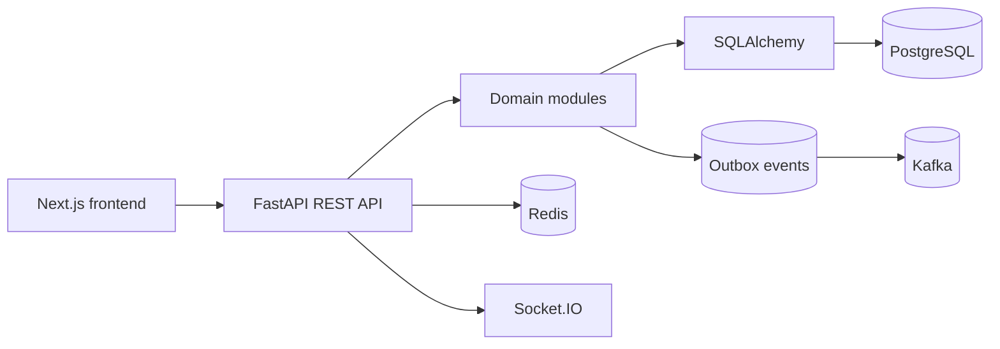

# Architecture

ShopScale starts as a modular monolith. The goal is to keep transactions and business rules simple while still giving each domain a clear boundary.

## Implemented

- Monorepo with `apps/backend` and `apps/frontend`
- Backend modules and services for auth, users, products, cart, orders, inventory, payments, admin, audit, and health
- Infrastructure adapters for database, Redis, Kafka, WebSockets, and logging
- FastAPI application with middleware, liveness, readiness, and centralized error handling
- SQLAlchemy-backed PostgreSQL readiness check
- Next.js shell with core routes
- Docker Compose environment with PostgreSQL, Redis, Kafka, Zookeeper, backend, and frontend
- Auth and user routes with service-owned business rules, SQLAlchemy persistence, JWT access tokens, refresh token rotation, and RBAC dependencies

## Planned Module Flow

Domain logic should live in module services, not route handlers. Route handlers will parse HTTP input, call services, and translate service results into API responses.

The order flow will use PostgreSQL transactions for inventory correctness. Kafka publishing should be driven through an outbox table so database writes and event creation are committed together.
