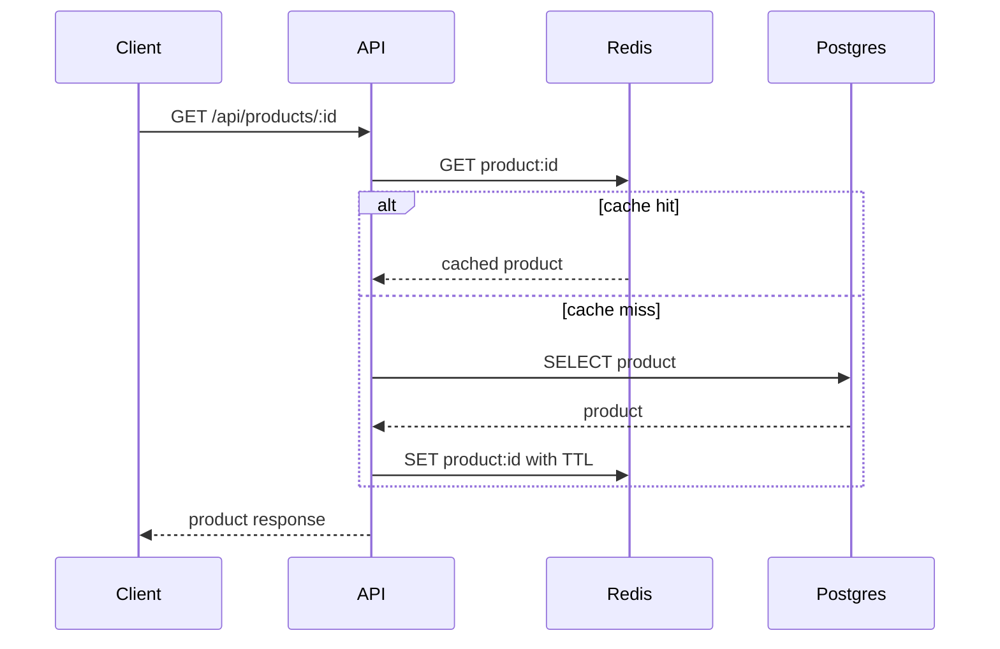

# Caching

Redis is included in the local environment for product caching and distributed rate limiting.

## Product Cache

`GET /api/products/:id` will use cache-aside:

`ProductService` implements this cache-aside flow with `product:<id>` keys and the
`PRODUCT_CACHE_TTL_SECONDS` setting. Product update and delete operations invalidate
the affected key. The application uses Redis outside tests and an in-memory store
for isolated test runs.

## Rate Limiting

Login, order creation, and payment creation use Redis-backed fixed-window counters.
The counter key includes the route, identity, and current window. Login identity is
the client IP plus normalized email; order and payment identity is the client IP.
When Redis is unavailable, the adapter fails open for reads and writes but the
middleware surfaces counter failures, making operational outages visible rather
than silently pretending to enforce a distributed limit.
